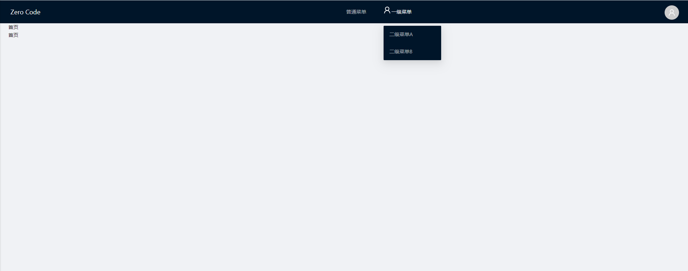

# Zero Code Admin

`Zero Code Admin` 是通过 `zero-json` 生成的脚手架项目, 提供了基础页面/布局等常用功能

## 导航风格定义

修改位于 `public/config.js` 文件下的内容可变更导航菜单的风格:

```javascript
window.ZEle.nav = "LeftNavCollaps";
```

目前预设了如下的导航风格

- #### LeftNavCollaps 
	
	
	
- #### top
	
	
- left

- both

> 该配置为静态变量, 更改后需要手动刷新页面才能生效

## 颜色风格定义

主题颜色的定义文件位于 `src/theme.less`, 会直接影响 导航颜色和按钮颜色

```css
@ZEle-primary-color        : #610b0b;
@ZEle-primary-color-light  : #860909;
@ZEle-primary-color-bgColor: #fcd0d0;
```
