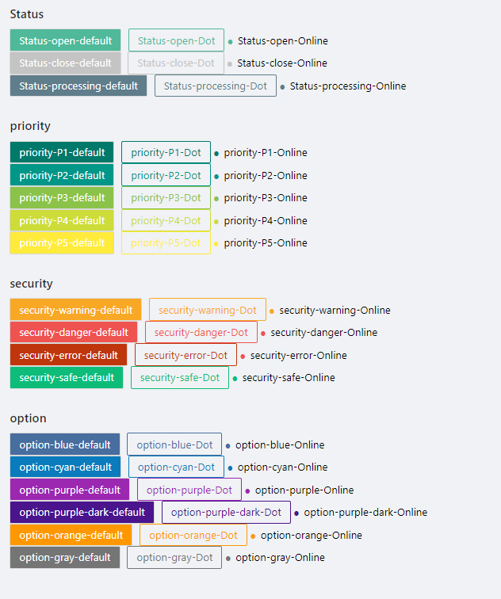

## ZEle config 数据格式

```javascript
<ZEle
  namespace=""
  config={} //  <---- 本文档介绍内容
/>
```

`config` 是 `ZEle` 里面的重要参数, 决定了 `ZEle` 渲染的内容

#### config 的基本数据结构

```javascript
{
  layout: '',
  title: '',
  items: [
    {
      component: '',
      config: {}
    },
    {
      component: '',
      config: {}
    },
    ...
  ]
}
```

#### 一个标准的 config 示例

该 `config` 可渲染一个较为功能完备的员工列表页 包括了以下内容

- 自动获取列表数据
- 可通过 员工姓名/员工生日 来对列表搜索
- 对列表数据进行了映射: 性别/状态
- 可对列表项进行删除
- 点击 新增/编辑 进行页面跳转

##### 属性配置

- [layout](#layout)

  > 页面级别的 `layout` 设置, 通常直接使用 'TitleContnet' 即可

- title

  > 标题设置, 可选

- items

  > 以流的形式由上到下渲染一些已注册的 [component](#component)

  > 通过 `component` 来指定欲渲染的 [component](#component)

  > 通过 `config` 来完成对 `component` 的配置

```javascript
{
  layout: 'TitleContnet', // 页面级别的 Layout
  title: '员工管理',  // 可选, 由上面的 layout 控制显示效果
  items: [
    {
      component: 'Search', // 渲染一个已注册的名为 Search 的组件
      config: { // 这里的 config 内容由 component 决定
        fields: [
          { label: '员工姓名', field: 'name', type: 'input' },
          { label: '员工生日', field: 'dob', type: 'date' },
        ]
      },
    },
    {
      component: 'Table',    // 渲染一个名为 Table 的组件
      config: {
        API: {
          listAPI: '/api/sys/user', // 组件渲染后, 将会自动调用这个 api 来获取列表数据
          deleteAPI: '/api/sys/user/(id)',
        },
        acitons: [
          { title: '新增员工', type: 'path', options: {
              path: '/sys/uers-add',  // 点击新增员工时, 跳转到这个页面
            }
          }
        ],
        fields: [
          { label: '员工姓名', field: 'name' },
          { label: '性别', field: 'sex', valueType: 'map', options: {
              map: {
                0: '男',
                1: '女',
              }
            }
          },
          { label: '手机', field: 'phone' },
          { label: '状态', field: 'status', valueType: 'tag', options: {
              map: {
                NORMAL: '正常',
                FORBIDDEN: '禁用',
              },
              color: {
                NORMAL: '#b7eb8f',
                FORBIDDEN: 'red',
              },
            }
          },
          { label: '生日', field: 'dob' },
        ],
        operation: [
          { title: '编辑', type: 'path', options: {
            outside: true,
            path: '/sys/uers-edit',    // 点击编辑时, 跳转到这个页面
          }
          },
          { title: '删除', type: 'delete' }, // 默认会调用上面的 API.deleteAPI
        ]
      }
    }
  ]
}
```

## 标准 field

在 `zero-element` 里面, 各式各样的组件里都会涉及到 `数据字段` 的概念, 这里会对这些字段的配置格式做出规范

目前, `标准 field` 里面包括了 `列表标准字段` 和 `表单标准字段` 两种:

### formField

> 链接：[自定义表单`field`](#自定义表单field)

#### 基本格式

```javascript
// 表单标准字段基本格式
{
  field: 'string',
  label: 'string',
  type: 'string',
  options: [] || {},
}
```

#### 介绍

`表单标准字段` 通常用于 `Search` `Form` `ChildrenForm` 等表单组件

#### 示例

一个标准的 `表单标准字段` 通常由以下配置项组成

```javascript
// 表单标准字段示意
{
  field: 'status',
  label: '状态',
  type: 'select', // 渲染为下拉框
  options: [
    { label: '正常', value: 'NORMAL' },
    { label: '禁用', value: 'FORBIDDEN' },
  ],
  rules: ['required']
},
{
  field: 'status',
  label: '状态',
  type: 'select-fetch', // 从 fetch 取到的数据中渲染为一个下拉框
  options: {
    API: '/api/example', // 发起的 API 请求地址
    label: 'title', // API 返回列表值的 title 作为下拉框的 label
    value: 'id', // API 返回列表值的 id 作为下拉框的 value
  },
  rules: ['required']
}
```

请注意, 同样是渲染一个下拉框, 两者使用的 `options` 的格式却不相同

- `type: 'select'` 使用的 `options` 为 数组格式
- `type: 'select-fetch'` 使用的 `options` 为 对象格式

这是因为它们分别是 `普通 type` 和 `高级 type`, 故而造成了这其中的差异

#### 可选的 Type

##### 普通 type

所谓 `普通 type`, 即为:

> - 或是功能过于简单而无需配置

> - 或是对 `antd` 的组件进行了简单的引用, 或者仅仅是简单的封装了一些参数再引用，然后注入到了 `zero-element` 里面的表单字段 type

`普通 type` 有以下可选值:

| 属性值                           | 说明                                                                 |
| -------------------------------- | -------------------------------------------------------------------- |
| [input](#标准表单字段配置项)     | `antd` 的单行的输入框                                                |
| [number](#标准表单字段配置项)    | `antd` 的数值输入框                                                  |
| [password](#标准表单字段配置项)  | `antd` 的密码输入框                                                  |
| [text-area](#标准表单字段配置项) | `antd` 的多行文本输入                                                |
| [radio](#标准表单字段配置项)     | `antd` 的单选                                                        |
| [select](#标准表单字段配置项)    | `antd` 的下拉框                                                      |
| [checkbox](#标准表单字段配置项)  | `antd` 的复选框                                                      |
| [group](#标准表单字段配置项)     | 显示为一个特殊的文本块, 用于分割布局                                 |
| [hidden](#标准表单字段配置项)    | 一个隐藏的字段, 不过仍然会占用一个布局的空间. 它的数值会随着表单提交 |
| [plain](#标准表单字段配置项)     | 以纯文本的形式显示一个字段. 它的数值会随着表单提交                   |
| rich-text                        | 富文本编辑器                                                         |

##### 高级 type

`高级 type` 有以下可选值:

| 属性值                                           | 说明                                      |
| ------------------------------------------------ | ----------------------------------------- |
| [plain](#Type plain)                             | `plain` 并不仅仅可当作 `普通 type` 来使用 |
| [date](#Type date and Type week and Type month)  | 日期选择                                  |
| [week](#Type date and Type week and Type month)  | 周选择                                    |
| [month](#Type date and Type week and Type month) | 月选择                                    |
| [range](#Type range)                             | 日期区间选择                              |
| [modal-radio](#Type modal-radio)                 | 在弹出的模态框中选择一条数据              |
| modal-checkbox                                   | 在弹出的模态框中选择多条数据              |
| upload-image                                     | 上传图片                                  |
| upload-file                                      | 上传文件                                  |
| select-fetch                                     | 从 API 中获取返回的列表作为下拉框的选项   |
| checkbox-fetch                                   | 从 API 中获取返回的列表作为复选框的选项   |
| number-range                                     | 数值区间输入                              |

#### Type 类详情

##### 标准表单字段配置项

###### props

基于 `antd` 直接封装的 `type` 都支持 `props`
可以通过 `props` 来传入一些 `antd` 原始支持的配置项

```javascript
{
  field: '', label: '', type: 'text-area', props: {
    placeholder: '请输入内容……',
    autoSize: {
      minRows: 4,
    }
  }
},
```

###### options

以下的 `type` 都使用同一种 `options` 格式

- radio
- select
- checkbox

```javascript
{
  field: '', label: '', type: 'radio', options: [
    { label: '男', value: 0 },
    { label: '女', value: 1 },
  ]
},
```

###### value

所有的 `标准表单字段` 都支持 `value`

通常情况下, `value` 的值将会随着表单一起提交

> 在 `field` 中以下横线 `_` 开头的 `value` 不会提交, 例如下面的 `_group_1`

```javascript
{
  field: '_group_1', type: 'group', value: '基本信息'
},
{
  field: '', label: '', type: 'hidden', value: ''
},
```

#### Type plain

`plain` 以纯文本的形式提交一份数据

##### options

###### format

选填项 `string`

根据传入的字符串模板来格式化回显, 提交的时候提交格式化后的回显值

一般需要配合 `placeholder` 一起使用

在下面的 `完整示例` 里, 演示了如何将 开始时间/结束时间显示在一起并提交

`<key>` 里面的 `key` 可以是同一个 `namespace` 里面的任意的表单字段名称

###### placeholder

选填项 `string`

处理模板里面的空值显示

> 默认值: "-"

###### map

选填项 `{}`

将数据做映射后再回显, 提交的时候提交映射后的回显值

`{}` 的 `key` 为后端返回的原始值, `value` 为映射后的值

##### 完整示例

```javascript
{ label: '', field: '', type: 'plain', options: {
    format: '<startDate> ~ <endDate>',
    placeholder: '暂无',
    map: {
      0: '不可用',
      test: '测试'
    },
}
```

#### Type date and Type week and Type month

提供了不同类型的时间录入方式

它们的配置项大同小异

##### options

###### nowTime

选填项 `boolean`

是否自动选择当前 日期/月/周

> 默认值: false

###### format

选填项 `string`

时间格式

> type `date` 默认值: "YYYY-MM-DD"

> type `week` 默认值: "YYYY-W"

> type `month` 默认值: "YYYY-MM"

###### props

选填项 `{}`

可以通过 `props` 来传入一些 `antd` 原始支持的配置项

##### 完整示例

```javascript
{ label: '', field: '', type: 'date', options: {
    format: 'YYYY-MM-DD',
    nowTime: true,
    props: {
      allowClear: true,
    }
}
```

#### Type range

录入时间的区间

##### options

###### nowTime

选填项 `boolean`

是否自动选择当前 日期/月/周

> 默认值: false

###### format

选填项 `string`

时间格式

> 默认值: "YYYY-MM-DD"

###### props

选填项 `{}`

可以通过 `props` 来传入一些 `antd` 原始支持的配置项

###### startDate 和 endDate

选填项 `string`

默认情况下, `range` 选择的两个数值将会以 `["YYYY-MM-DD", "YYYY-MM-DD"]` 的形式提交到 `field`

可以通过同时配置 `startDate` 和 `endDate` 来将时间区间额外提交到两个不同的字段

##### 完整示例

```javascript
{ label: '', field: '', type: 'range', options: {
    format: 'YYYY-MM-DD',
    nowTime: true,
    props: {
      allowClear: true,
    },
    startDate: 'startDateField',
    endDate: 'endDateField',
}
```

#### Type modal-radio

点击一个按钮, 在弹出的模态框中选择一条数据

##### options

###### \*API

必填项 `string`

模态框里面的列表数据的 API

###### \*fields

必填项 [列表标准字段](#listfield)

模态框里面的列表的字段

###### searchFields

选填项 [表单标准字段](#formfield)

模态框里面的 `Search` 的字段

如果配置 `false`, 那么就会不显示 `Search`

> 默认值: `[{ label: '搜索', field: 'search', type: 'input', placeholder: '请输入搜索内容...' }]`

###### pagination

选填项 `boolean`

模态框里面的列表是否启用分页

> 默认值: false

###### title

选填项 `string`

按钮的文本, 在未选择数据之前起引导作用 模态框的 title

> 默认值: "选择数据"

###### modalWidth

选填项 `string` 或者 `number`

弹出的模态框的宽度

###### label

选填项 `string`

按钮的文本, 在选择了数据之后, 会读取已选择的数据里面的 `label` 作为回显

> 默认值: "name"

###### editLabel

选填项 `string`

按钮的文本, 如若是一个用于编辑数据的表单, 那么从 API 返回的数据里面选择 `editLabel` 字段作为回显

> 默认值会读取 `label` 的值作为默认值

###### saveData

选填项 `{}`

把选中数据的额外字段保存出来

`{}` 的 `key` 是保存出来的字段, `value` 是选中数据里需要额外保存的字段

##### 完整示例

```javascript
{ label: '', field: '', type: 'modal-radio', options: {
    API: '/api/example',
    searchFields: [
      { label: '订单编号', field: 'orderNumber', type: 'input' },
    ],
    fields: [
      { label: '订单编号', field: 'orderNumber' },
      { label: '订单总金额', field: 'money', valueType: 'currency' },
    ],
    saveData: {
      'totalMoney': 'money', // 同时将选中订单的金额保存为 totalMoney
    },
    title: '选择待处理订单',
    modalWidth: 780,
    label: 'orderNumber',
    editLabel: 'orderNumber',
    pagination: true,
},
{ label: '订单总金额', field: 'totalMoney', type: 'plain' }
```

#### Type one-mary

处理一对多关系

##### options

`one-mary` 的配置结构与 `Table` 类似

###### actions

选填项 `[]`

一对多里面的 `List Action`

**type `children-modal-add`**

弹出一个模态框来进行子项数据的添加

普通的 `List Action` 会使用 type [modal](../../component/Table.md#actions%20type%20`modal`) 来弹出一个模态框, 而不同的是 `one-mary` 这里一般会使用特殊的 type `children-modal-add`

同时, 里面的 component 应该使用 `ChildrenForm`

里面的 config 应该与 `Form` 的 `config` 相同

###### \*fields

必填项 [列表标准字段](/ZELeconfig/标准field/list-field)

显示出来的列表的字段

###### operation

对一对多子项数据进行操作

**type `childEditModal`**

弹出一个模态框来进行子项数据的编辑

请注意这里需要使用特殊的 type `childEditModal`

同时, 里面的 component 应该使用 `ChildrenForm`

里面的 config 应当与 [Form](/ZELeconfig/component/Form.md) 的 `config` 相同

##### 完整示例

```javascript
{
  field: 'items', label: '', type: 'one-mary', span: 24, options: {
    actions: [
      {
        title: '添加产品', type: 'children-modal-add', options: {
          modalTitle: '添加产品',
          modalWidth: 580,
          items: [
            {
              component: 'ChildrenForm',
              config: { // 表单的标准配置
                fields: []
              },
            }
          ],
        }
      },
    ],
    fields: [
      { label: '产品编号', field: 'product' },
      { label: '产品', field: 'itemName' },
      { label: '产品单价', field: 'price' },
      { label: '税率', field: 'taxRatio' },
      { label: '数量', field: 'amount' },
    ],
    operation: [
      {
        title: '编辑', type: 'childEditModal',
        options: {
          outside: true,
          modalTitle: '编辑产品',
          modalWidth: 580,
          items: [
            {
              component: 'ChildrenForm',
              config: { // 表单的标准配置
                fields: []
              },
            }
          ],
        }
      },
      {
        title: '移除', type: 'removeChild',
        options: {
          outside: true,
        }
      },
    ],
  }
}
```

#### 自定义表单 field

1. 创建方法
   创建一个叫做 `MyFormField.js` 的文件
   在项目的入口引用这个文件
   将这个文件命名为 `my-form-field` 并注入

> 标准 field 里面, field 的命名应该使用连词符 `-` 而不是使用驼峰

```javascript
import { set as FITSet } from 'zero-element/lib/config/formItemType';
import MyFormField from './MyFormField.js';

FITSet({
  'my-form-field': MyFormField,
});
```

2. 使用自定义表单 `field`

```javascript
const config = {
  items: [
    {
      component: 'Form',
      config: {
        fields: [
          {
            label: '我的自定义 field',
            field: '',
            type: 'my-form-field',
          },
        ],
      },
    },
  ],
};

return <ZEle namespace="" config={config} />;
```

#### rules 表单数据校验

可通过 `rules` 来完成表单数据的校验

有如下的预设校验规则:

- required

- email

- phone

- url

可直接将预设规则的名称传入 `rules`

如果想要自定义警告提示, 也可传入 `{ type: '', message: '' }`, 然后在 `message` 里面自定义

```javascript
{ label: '', field: '', type: '',
 rules: ['required']
},

{ label: '', field: '', type: '',
 rules: [{
  type: 'required',
  message: '该项是必填的'
 }]
},

```

##### rules.expect

可以让校验规则在满足某些条件下才生效, [参见](#rules.expect)

### listField

> [自定义 ValueType](#自定义ValueType)

#### 基本格式

```javascript
// 列表标准字段基本格式
{
  field: 'string',
  label: 'string',
  valueType: 'string',
  options: {}
}
```

#### 说明

`列表标准字段` 通常用于 `Table` `ChildrenTable` `ReportTable` 等列表组件

#### 示例

一个标准的 `列表标准字段` 通常由以下配置项组成

```javascript
// 列表标准字段示意
// 这里将后台返回的 status 字段, 映射为 '正常' '禁用' 这样的中文
// 同时, '正常' 是个绿色的标签, '禁用' 是个红色的标签
{
  field: 'status',
  label: '状态',
  valueType: 'tag', // 以标签的形式渲染 status
  options: { // options 的配置项由 valueType 决定
    map: {  // 映射后端的 status 字典
      NORMAL: '正常',
      FORBIDDEN: '禁用',
    },
    color: {
      NORMAL: '#3f6600',
      FORBIDDEN: 'red',
    },
  }
}
```

#### 字段配置

例如后端返回了如下假数据:

```javascript
// GET API response body
{
  code: 200,
  data: [
    { id: 1, name: '小明', sex: 0 },
    { id: 2, name: '小红', sex: 1 },
  ]
}
```

##### field

配置后端的返回的字段值

以上面的假数据举例的话, 应该这样配置:

```javascript
[{ field: 'id' }, { field: 'name' }, { field: 'sex' }];
```

##### label

配置表格的表头, 通常是后端返回字段的中文名

以上面的假数据举例的话, 并且与 `field` 相结合的话, 应该这样配置:

```javascript
[
  { label: 'ID', field: 'id' },
  { label: '名称', field: 'name' },
  { label: '性别', field: 'sex' },
];
```

#### [可选配置项] valueType 与 options

通常来说, 表格都是直接将后端返回的数据以字符串的形式直接渲染出来, 通过这两个配置可以将数据渲染为其它形式

`options` 必须配合 `valueType` 使用, 因为 `valueType` 决定了 `options` 的可配置项

以上面的假数据举例的话, 并且与 `label` `field` 相结合的话, 应该这样配置:

```javascript
[
  { label: 'ID', field: 'id' },
  { label: '名称', field: 'name' },
  {
    label: '性别',
    field: 'sex',
    valueType: 'map',
    options: {
      map: {
        0: '男',
        1: '女',
      },
    },
  },
];
```

最终上面的假数据将会渲染为类似这样的表格:

| ID  | 名称 | 性别 |
| --- | ---- | ---- |
| 1   | 小明 | 男   |
| 2   | 小红 | 女   |

可用的`valueType`:

#### ValueType Plain

返回单行或多行可变的字符串

##### options

###### format

选填项 `string` or `array`

可用将别的字段一起显示在这个 `valueType plain` 里面 这里将用作回显的模板

传入 `array` 可以分行显示

一般需要配合 `placeholder` 一起使用

在下面的 `完整示例` 里, 演示了如何将 姓名/电话 信息显示在一个表格单页, 并分行

`<key>` 里面的 `key` 可以是当前行数据里面的任意字段名称

###### placeholder

选填项 `string`

处理模板里面的空值显示

> 默认值为空字符: ""

##### 完整示例

```javascript
{ label: '', field: '', valueType: 'plain', options: {
    format: ['姓名: <name>', '电话: <phone>'],
    placeholder: '-',
}

// 该 valueType 没有必填项, 故而也可以
{ label: '', field: '', valueType: 'plain' }
```

#### ValueType map

以纯字符串的形式映射返回的值

##### options

###### \*map

必填项 `{}`

表明映射关系

`{}` 的 `key` 为后端返回的原始值, `value` 为映射后的值

##### 完整示例

```javascript
{ label: '', field: '', valueType: 'map', options: {
    map: {
      0: '不可用',
      test: '测试'
    }
}
```

#### ValueType tag

以带有颜色的标签的形式映射返回的值

##### options

###### \*map

必填项 `{}`

表明映射关系

`{}` 的 `key` 为后端返回的原始值, `value` 为映射后的值

###### chy

选填项`{}`

设立每个映射关系的 state 值

##### data

###### text

选填项 `""`

文本内容,默认为"-",若 map 存在，无需加入

###### theme

选填项 `""`,

风格定义

默认项

1. Status
2. priority
3. security
4. option

###### type

选填项 `""`

类型定义

默认项

1. default --默认 文字为白色 背景更变颜色
2. Dot --点 文字颜色为黑，更变前缀点
3. Online --线框 背景为空 线框文字颜色更变

###### state

选填项 `""`

状态定义，若 chy 存在，无需定义

详见[图示](#Tag标签图示)

中间为 state 值

##### Tag 标签图示



##### 完整示例

```javascript
{
    label: '', field: '', valueType: 'tag', options: 	{
        map: {
            0: '开启',
            1: '关闭'
        },
        chy: {
      		0: 'open',
      		1: 'close'
    	},
   },
   theme:'status',
   type:'default'
}
```

#### ValueType currency

将返回的值渲染为货币形式

##### options

###### symbol

选填项 `string`

表示货币的符号

> 默认值 '￥'

###### color

选填项 `string`

可用来调整文本颜色

###### nullPlaceholder

选填项 `string`

当后端数据返回 `null` 时, 将会显示为 `nullPlaceholder` 传入的值

##### 完整示例

```javascript
{ label: '', field: '', valueType: 'currency', options: {
    symbol: '￥',
    color: '#3f6600',
    nullPlaceholder: '暂无',
}

// 该 valueType 没有必填项, 故而也可以
{ label: '', field: '', valueType: 'currency' }
```

#### ValueType percentage

将返回的值渲染为百分号形式

##### options

###### color

选填项 `string`

可用来调整文本颜色

###### nullPlaceholder

选填项 `string`

当后端数据返回 `null` 时, 将会显示为 `nullPlaceholder` 传入的值

##### 完整示例

```javascript
{ label: '', field: '', valueType: 'percentage', options: {
    color: '#3f6600',
    nullPlaceholder: '暂无',
}

// 该 valueType 没有必填项, 故而也可以
{ label: '', field: '', valueType: 'percentage' }
```

#### ValueType image

将返回的值渲染为图片, 点击图片可预览大图

##### options

###### max

选填项 `number`

如若有多张图片, 最多只渲染多少张

> 默认值: 9

###### width

选填项 `number` 或 `string`

渲染的图片的宽度

> 默认值: 60

###### height

选填项 `number` 或 `string`

渲染的图片的高度

> 默认值: 60

###### circle

选填项 `boolean`

是否将图片渲染为圆形

> 默认值: false

###### border

选填项 `boolean`

是否在图片周围渲染一条边框, 在纯白色的背景颜色里建议加上这个配置项

> 默认值: false

###### background

选填项 `boolean`

是否以背景图片的样式进行渲染

背景图片的样式将会带有居中的效果

> 默认值: false

##### 完整示例

```javascript
{ label: '', field: '', valueType: 'image', options: {
    max: 1,
    width: 60, // 等效 '60px'
    height: '60px',
    circle: true,
    border: true,
    background: true,
}

// 该 valueType 没有必填项, 故而也可以
{ label: '', field: '', valueType: 'image' }
```

#### ValueType ellipsis

超过长度限制的文本显示为省略号, 鼠标移上去可显示完整文本

##### options

###### max

选填项 `number`

文本的长度限制, 超出部分将会显示为省略号

> 默认值 16

###### format

选填项 `string`

可用将别的字段一起显示在这个 `valueType ellipsis` 里面 这里将用作回显的模板

一般需要配合 `placeholder` 一起使用

在下面的 `完整示例` 里, 演示了如何将 电话/省市区 信息显示在一起

`<key>` 里面的 `key` 可以是当前行数据里面的任意字段名称

###### placeholder

选填项 `string`

处理模板里面的空值显示

> 默认值为空字符: ""

##### 完整示例

```javascript
{ label: '', field: '', valueType: 'ellipsis', options: {
    max: 30,
    format: '联系电话: <phone>, 联系地址: <province> <city> <district>',
    placeholder: '-',
}

// 该 valueType 没有必填项, 故而也可以
{ label: '', field: '', valueType: 'ellipsis' }
```

#### 自定义 ValueType

1. ##### 创建

创建一个叫做 `MyListField.js` 的文件

在项目的入口引用这个文件

将这个文件命名为 `my-list-field` 并注入

> 注入的命名应该使用连词符 `-` 而不是使用驼峰

```javascript
import { set as VTSet } from 'zero-element/lib/config/valueType';
import MyListField from './MyListField.js';

VTSet({
  'my-list-field': MyListField,
});
```

2. ##### 使用自定义列表 `valueType`

```javascript
const config = {
  items: [
    {
      component: 'Table',
      config: {
        fields: [
          {
            label: '我的自定义 field',
            field: '',
            valueType: 'my-list-field',
          },
        ],
      },
    },
  ],
};

return <ZEle namespace="" config={config} />;
```

## component

> [自定义 Component](#自定义component)

配置里面的 `component` 决定了 `ZEle` 渲染哪些组件

`ZEle` 里面预设了以下一些常用的 `component`组件

#### component Table

`Table` 将渲染为一个表格, 可以与 component [Search](#component Search) 搭配使用

`Table` 会和同一个 `namespace` 下面的 [Search](#component Search) 自动绑定, 点击 [Search](/ZEleconfig/component/Search.md) 的搜索会自动触发 `Table` 的数据更新

> 与之相对的, 同一个 `namespace` 里面应当只有一对 `Table` 与 [Search](#component Search) 的组合, 不然无法保证搜索逻辑绑定正确

---

##### config `API`

###### listAPI

`Table` 初始化时自动访问的 api, 并将返回的数据填入 `fields` 里面的表格列

###### deleteAPI

表格的数据项的删除 api, 在配置了 `operation type delete` 的情况下需要同时配置 `deleteAPI`

---

##### config `actions` [[自定义](#自定义actions)]

一般地, 将 `Table` 的整体性的操作称之为 `actions`, 将会渲染为按钮的形式

`actions` 是个 Object[], 每个 `actions` 的子项 Object 的数据结构如下

```javascript
{ title: '', type: '', options: {} }
```

`title` 是显示在按钮中的文本

`type` 与 `options` 必须搭配使用, 决定了 `actions` 子项的具体功能

##### actions type `path`

点击后跳转页面

###### options

_path `string`_

具体的跳转路由

###### 示例

```javascript
{ title: '', type: 'path', options: {
    path: '/sys/user-add',
  }
}
```

##### actions type `modal`

点击后弹出一个模态框, 可以用来完成单项表格数据的新增

###### options

_modalTitle `string`_

模态框的标题

_modalWidth `string`_

模态框的宽度

_modalStyle `int`_

模态框弹出位置

- modalStyle 属性
- 默认居中
- marginLeft 从左边偏移位置
- marginRight 从右边偏移位置

_items `config[]`_

模态框的具体渲染内容, 有完整的渲染 [config](#ZEle config 数据格式) 的能力

###### 示例

```javascript
{ title: '', type: 'modal', options: {
    modalTitle: '添加数据',
    modalWidth: 1000,
    modalStyle: { marginLeft: 100 },
    items: [
      {
        component: 'Form',
        config: {
          API: {
            createAPI: '/api/sys/user',
          },
          fields: [
            { label: '', field: '', type: '' },
          ]
        }
      }
    ]
  }
}
```

---

##### config `fields`

由 [列表标准字段](#listfield) 组成的列表, 将会渲染具体的表格列

---

##### config `operation` [[自定义](#自定义operation)]

一般地, 将对 `Table` 具体数据的操作称之为 `operation`, 会渲染在每项(行)表格数据的右边

`operation` 是个 Object[], 每个 `operation` 的子项 Object 的数据结构如下

```javascript
{ title: '', type: '', options: {} }
```

`title` 是显示在按钮中的文本

`type` 与 `options` 必须搭配使用, 决定了 `operation` 子项的具体功能

##### operation type `path`

点击后跳转页面

###### options

**path `string`**

具体的跳转路由

###### 示例

```javascript
{ title: '', type: 'path', options: {
    path: '/sys/user-add',
  }
}
```

##### operation type `request`

点击后直接访问 api, 如 提交功能

###### options

_outside (true or false: ) 默认展示或收起按钮_

_API `string`_

_method post_

**[expect](#expect)**

###### 示例

```javascript
{
  title: '提交',
  type: 'request',
  options:{
    outside: false,
    API: '',
    method: 'post'
  },
  expect: {}
},
```

##### operation type `modal`

点击后弹出一个模态框, 可以用来完成对表格单项数据的编辑

###### options

_modalTitle `string`_

模态框的标题

_modalWidth `string`_

模态框的宽度

_items `config[]`_

模态框的具体渲染内容, 有完整的渲染 [config](/ZEleconfig) 的能力

###### 示例

```javascript
{ title: '', type: 'modal', options: {
    modalTitle: '编辑数据',
    modalWidth: 1000,
    items: [
      {
        component: 'Form',
        config: {
          API: {
            getAPI: '/api/sys/user/(id)',
            updateAPI: '/api/sys/user/(id)',
          },
          fields: [
            { label: '', field: '', type: '' },
          ]
        }
      }
    ]
  }
}
```

##### operation type `delete`

点击后删除当前行的数据项

###### options

无需配置 options, 删除时将会调用 `API deleteAPI` 指定的 api

---

##### 完整示例

```javascript
{
  component: 'Table',
  config: {
    API: {
      listAPI: '',
      deleteAPI: '', // 下面的 operation type delete 会调用这个 api
    },
    actions: [],
    fields: [
      { label: '', field: '', type: '' },
      ...
    ],
    operation: [
      { title: '', type: 'modal', options: {
          modalTitle: '编辑数据',
          modalWidth: 1000,
          items: [
            {
              component: 'Form',
              config: {
                API: {
                  getAPI: '/api/sys/user/(id)',
                  updateAPI: '/api/sys/user/(id)',
                },
                fields: [
                  { label: '', field: '', type: '' },
                ]
              }
            }
          ]
        }
      },
      { title: '删除', type: 'delete' } // 删除时会调用上面的 API deleteAPI
    ],
  }
}
```

#### component AutoReport

自动报表 `AutoReport` 展示数据几乎全部由 api 返回的数据决定

##### config `API`

###### listAPI

`AutoReport` 初始化时自动访问的 api, 该 api 要求返回报表所需的全部数据

api 返回的数据结构示意

```json
{
  "code": 200,
  "data": {
    "columns": [
      // 列表的数据类型
      "S",
      "D",
      "S"
    ],
    "header": [
      // 列表的表头
      "时间",
      "金额",
      "明细"
    ],
    "rows": [
      // 列表的具体数据
      {
        "时间": "2020-01-01",
        "金额": "123.45",
        "明细": "张三/出差-车费报销"
      }
    ],
    "searchColumns": [
      // 搜索过滤字段, 需要配合 component AutoReportSearch 使用
      "时间",
      "明细"
    ],
    "current": 1, // 以下是常规的分页数据信息
    "size": 10,
    "total": 13
  }
}
```

其中的列表的数据类型 `columns`, 目前支持以下几种:

- C 数量, 展示数据时自动右对齐
- D 金钱, 展示数据时自动右对齐, 同上加上货币符号
- P 百分比, 展示数据时自动右对齐, 同时加上百分号
- S 展示为普通的文本字符串, 无特殊处理
- T 展示为普通的文本字符串, 无特殊处理

##### 完整示例 (含 AutoReportSearch)

```javascript
{
  layout: 'Content',
  title: '员工数据报表',
  items: [
    {
      component: 'AutoReportSearch',
      config: {},
    },
    {
      component: 'AutoReport',
      config: {
        pageSize: 20,
        API: {
          listAPI: '/api/report/user',
        },
        actions: [
          {
            title: '导出 pdf', type: 'export',
            options: {
              API: '/api/io/pdf/export/员工报表',
              method: 'get',
            },
          },
        ],
        fields: [],
        operation: []
      },
    },
  ],
}
```

#### component ItemList

传入一个 `Item`, 随后 `ItemList` 会将 `Item` 渲染为列表

##### props `Item`

必须的参数, 用来渲染 item 子项

##### 完整示例

###### 文件 index.js

```javascript
import MyItem from './MyItem';
import config from './config';

export default function() {
  return (
    <ZEle
      namespace=""
      Item={MyItem} // 传入 Item
      config={config}
    />
  );
}
```

###### 文件 MyItem.js

```javascript
import React from 'react';

export default function MyItem(props) {
  const { index, data, handle } = props;

  return (
    <div>
      <div>No.{index}</div>
      <div>员工名称:{data.title}</div>
      <div onClick={handle.onDelete}>删除员工</div>
    </div>
  );
}
```

###### 文件 config.js

```javascript
module.exports = {
  layout: 'Content',
  title: '自定义列表子项',
  items: [
    {
      component: 'ItemList',
      config: {
        API: {
          listAPI: '/api/sys/user',
        },
        fields: [],
      },
    },
  ],
};
```

#### component Search

`Search` 将渲染为一个用于搜索的表单, 通常与 component [Table](./Table.md) 搭配使用

`Search` 会和同一个 `namespace` 下面的 [Table](./Table.md) 自动绑定, 点击 `Search` 的搜索会自动触发 [Table](./Table.md) 的数据更新

> 与之相对的, 同一个 `namespace` 里面应当只有一对 `Search` 与 [Table](./Table.md) 的组合, 不然无法保证搜索逻辑绑定正确

---

##### config `fields`

由 [表单标准字段](/ZEleconfig/标准field/form-field) 组成的列表, 将会渲染具体的表单域

##### config `type`

必填！type:'default',值为 default,不填样式无法为默认样式！

---

###### 完整示例

```javascript
{
  component: 'Search',
  config: {
    type:'default'
    fields: [
      { label: '', field: '', type: '' },
      ...
    ],
  }
}
```

#### component Form

`Form` 将渲染为一个表单

- API
- fields, 是[表单标准字段](/ZEleconfig/标准field/form-field)

---

##### config `API`

`Form` 的对数据的提交方式, 将会由 `API` 的配置来决定

> `getAPI` 可以与 `createAPI` `updateAPI` 搭配一起使用

> `createAPI` 与 `updateAPI` 是互斥的, 不应该在一起使用

###### createAPI

配置了 `createAPI` 的即为一个 `创建数据的表单`, 点击提交按钮时会将数据以 `POST` 的方式发送到 `createAPI` 指定的 api

```javascript
API: {
  createAPI: '/api/sys/uers';
}
```

###### getAPI

`getAPI` 将会在 `Form` 初始化时调用, 将会从 api 中获取数据并填入 `fields` 里面对应的表单域

```javascript
API: {
  getAPI: '/api/sys/uers/[id]';
}
```

###### updateAPI

配置了 `updateAPI` 的即为一个 `编辑数据的表单`, 点击提交按钮时会将数据以 `PUT` 的方式发送到 `updateAPI` 指定的 api

> 一般与 getAPI 来配合完成一个编辑页

```javascript
API: {
  updateAPI: '/api/sys/uers/[id]';
}
```

---

##### config `fields`

由 [表单标准字段](#formfield) 组成的列表, 将会渲染具体的表单域

---

###### 完整示例

```javascript
{
  component: 'Form',
  config: {
    API: {
      createAPI: '/api/sys/uers',
      getAPI: '/api/sys/uers/[id]',
      updateAPI: '/api/sys/uers/[id]'
    },
    fields: [
      { label: '', field: '', type: '' },
      ...
    ],
  }
}
```

#### 关于自定义

##### 自定义 actions

###### 创建

创建一个叫做 `MyAction.js` 的文件

在项目的入口引用这个文件

将这个文件命名为 `myAction` 并注入

```javascript
import { set as AITSet } from 'zero-element/lib/config/actionItemType';
import MyAction from './MyAction.js';

AITSet({
  myAction: MyAction,
});
```

###### 使用自定义 `actions`

```javascript
const config = {
  items: [
    {
      component: 'Table',
      config: {
        actions: [
          {
            title: '我的自定义 action',
            type: 'myAction',
          },
        ],
      },
    },
  ],
};

return <ZEle namespace="" config={config} />;
```

##### 自定义 operation

###### 创建

创建一个叫做 `MyOperation.js` 的文件

在项目的入口引用这个文件

将这个文件命名为 `onMyOperation` 并注入

> 注意, 必须命名为 `onXxxx` 这样的 on + 驼峰 的形式注入

```javascript
import { set as LASet } from 'zero-element/lib/config/listAction';
import MyOperation from './MyOperation.js';

LASet({
  onMyOperation: MyOperation,
});
```

###### 使用自定义 `operation`

```javascript
const config = {
  items: [
    {
      component: 'Table',
      config: {
        operation: [
          {
            title: '我的自定义 operation',
            type: 'onMyOperation',
            options: {
              outside: false,
            },
          },
        ],
      },
    },
  ],
};

return <ZEle namespace="" config={config} />;
```

##### 自定义 component

###### 创建

创建一个叫做 `MyComponent.js` 的文件

在项目的入口引用这个文件

将这个文件命名为 `MyComponent` 并注入

```javascript
import { set as CSet } from 'zero-element/lib/config/container';
import MyComponent from './MyComponent.js';

CSet({
  MyComponent: MyComponent,
});
```

###### 使用自定义 `component`

```javascript
const config = {
  items: [
    {
      component: 'MyComponent',
    },
  ],
};

return <ZEle namespace="" config={config} />;
```

## layout

`layout` 决定内容的布局, 通常用于一个页面的整体布局, 部分 `component` 也会提供 `子 layout 配置项` 来完成某些组件内部的布局

### 已有的 layout

- Empty 无特殊功能, 默认 layout
- BaseTitle 无底色, 带有 title 功能的 layout
- Content 有白色的背景色, 同时提供了 title 功能; 如果用在 [Table](#component Table), 那么 `Table action` 将会显示在 title 的下方
- TitleContent 有白色的背景色, 同时提供了 title 功能; 如果用在 [Table](#component Table), 那么 `Table action` 将会显示在 title 同级的右边
- NotTitleContent 有白色的背景色
- Grid 使用 `Grid` 布局, 每行划分为 `24` 列, 通过给子元素的 props 传递 `span` 来指定占据多少列

### 自定义 `layout`

例如, 希望改进原有的 `layout Empty`, 希望它在没有传入子组件的情况下, 显示 antd 的 `Empty`

创建一个叫做 `Empty.js` 的文件

在项目的入口引用这个文件

因为是要覆盖原 layout 组件, 故需要作为同名的 `Empty` 注入

```javascript
import { set as LayoutSet } from 'zero-element/lib/config/layout';
import Empty from './Empty.js';

LayoutSet({
  Empty: Empty,
});
```

#### 使用自定义 `layout`

```javascript
const config = {
  layout: 'Empty',
  items: [
    {
      component: '',
      config: {},
    },
  ],
};

return <ZEle namespace="" config={config} />;
```

##### 改进后的 `Empty.js` 文件代码参考

```javascript
import React from 'react';
import { Empty } from 'antd';

export default function MyEmpty(props) {
  const { style, children } = props;

  if (React.Children.count(children) === 0) {
    return <Empty />;
  }

  return <div style={style}>{children}</div>;
}
```

## expect

`expect` 可决定字段的渲染时机, 数据不满足预期的情况下对应的字段就不会渲染

### options

- field 需要检测的字段
- value 该字段的预期值

此外, `expect.value` 也有一些预设的校验规则

- `IS_NULL` 表示数据是 空对象, 空数组, 空字符, null, false 其中之一
- `IS_NOT_NULL` 表示数据不是 空对象, 空数组, 空字符, null, false 其中之一

#### formfields.expect

`expcet` 可以在 [表单标准字段](#formfield) 里使用

例如, 默认的情况下只显示单选框, 若用户选择了 `其它`, 那么就让用户输入 `其它方式`

```javascript
{ label: '出行方式', field: 'travelMode', type: 'radio', options: [
    { label: '汽车', value: 'car' },
    { label: '其它', value: 'other' },
  ]
},
{ label: '其它方式', field: '', type: 'input',
  props: {
    placeholder: '请输入出行方式……'
  },
  expect: {
    field: 'travelMode',
    value: 'other',
  }
}
```

#### listField.expect

`expcet` 可以在 [列表标准字段](#listfield) 里使用

例如, `审核通过` 的按钮, 只会在 `status`的值为 `Pending` 的情况下才会显示

```javascript
{ title: '审核通过', type: 'request',
  options: {
    API: '/api/review/(id)/pass',
  },
  expect: {
    field: 'status',
    value: 'Pending',
  },
}
{ title: '删除', type: 'delete' }
```

再例如, `审核通过` 的按钮, 只会在 `status`的值为 `Pending` 或 `Reviewing` 的情况下才会显示

```javascript
{ title: '审核通过', type: 'request',
  options: {
    API: '/api/review/(id)/pass',
  },
  expect: {
    field: 'status',
    value: ['Pending', 'Reviewing'],
  },
}
```

又例如, `审核通过` 的按钮, 在同时满足以下条件才会出现

- `status`的值为 `Pending` 或 `Reviewing`
- `attachment`的值非空

```javascript
{ title: '审核通过', type: 'request',
  options: {
    API: '/api/review/(id)/pass',
  },
  expect: {
    field: ['Pending', 'attachment'],
    value: [
      ['Pending', 'Reviewing'],
      'IS_NOT_NULL'
    ],
  },
}
```

#### rules.expect

`expcet` 可以在 `rules` 里使用

例如, 必须让用户填入 电话号码/微信/邮箱 三者中的其中一个

一开始三个字段都是必填, 在用户输入了其中某一个字段之后, 其它两个字段就会变成非必填

```javascript
{
  field: 'contactPhone', label: '电话号码', type: 'input',
  rules: ['phone', {
    type: 'required',
    expect: {
      field: ['contactWechat', 'contactEmail'],
      value: ['IS_NULL', 'IS_NULL'],
    },
  }],
},
{
  field: 'contactWechat', label: '微信', type: 'input',
  rules: [{
    type: 'required',
    expect: {
      field: ['contactPhone', 'contactEmail'],
      value: ['IS_NULL', 'IS_NULL'],
    },
  }],
},
{
  field: 'contactEmail', label: '邮箱', type: 'input',
  rules: ['email', {
    type: 'required',
    expect: {
      field: ['contactPhone', 'contactWechat'],
      value: ['IS_NULL', 'IS_NULL'],
    },
  }],
},
```
