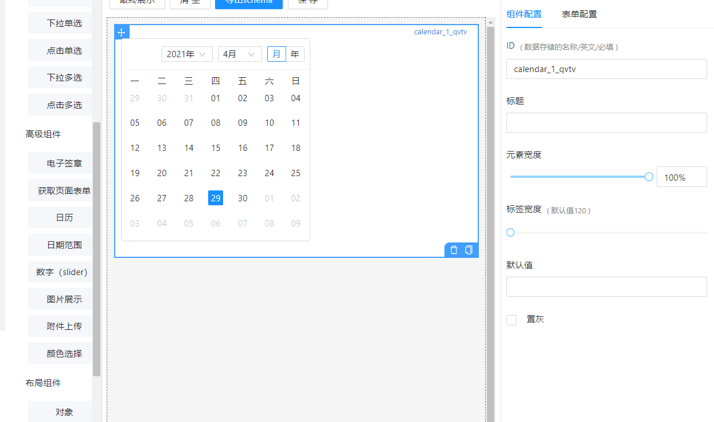
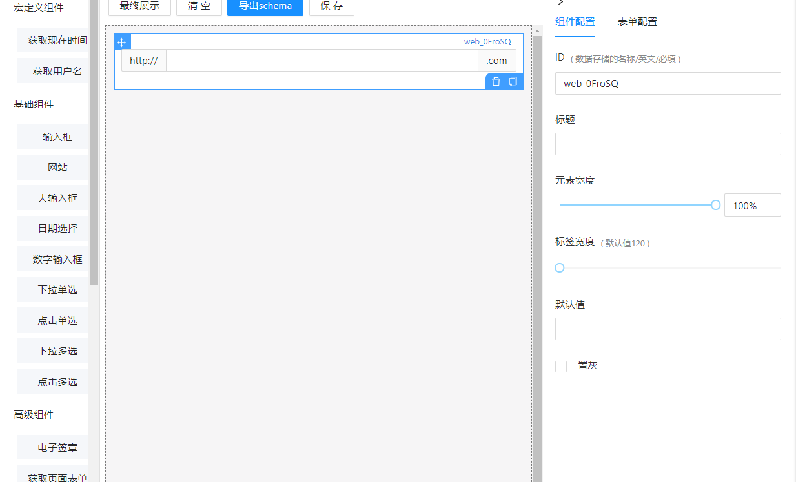
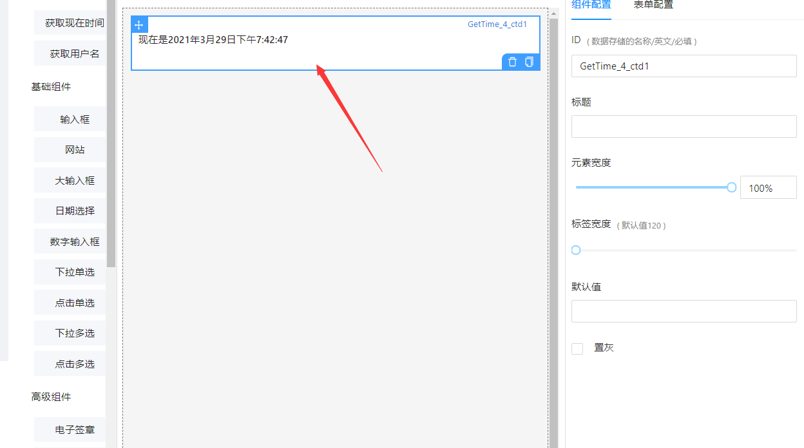
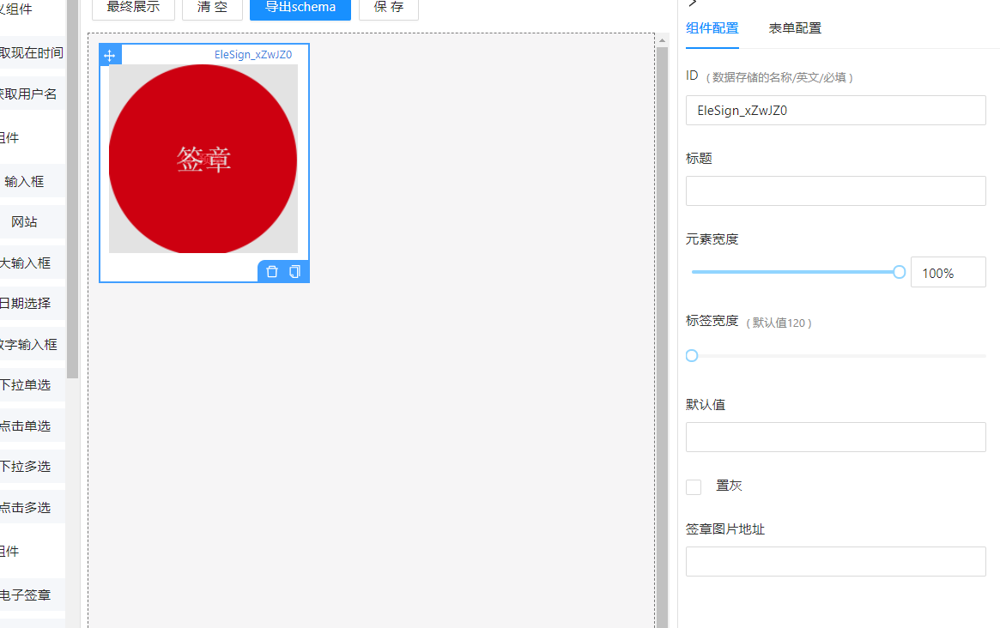
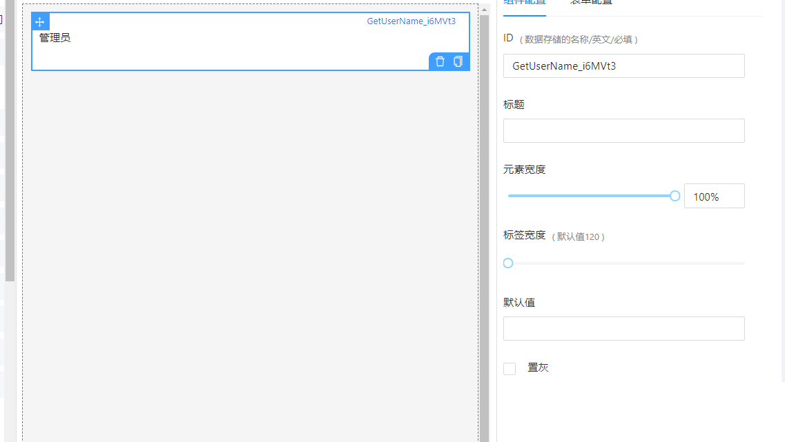
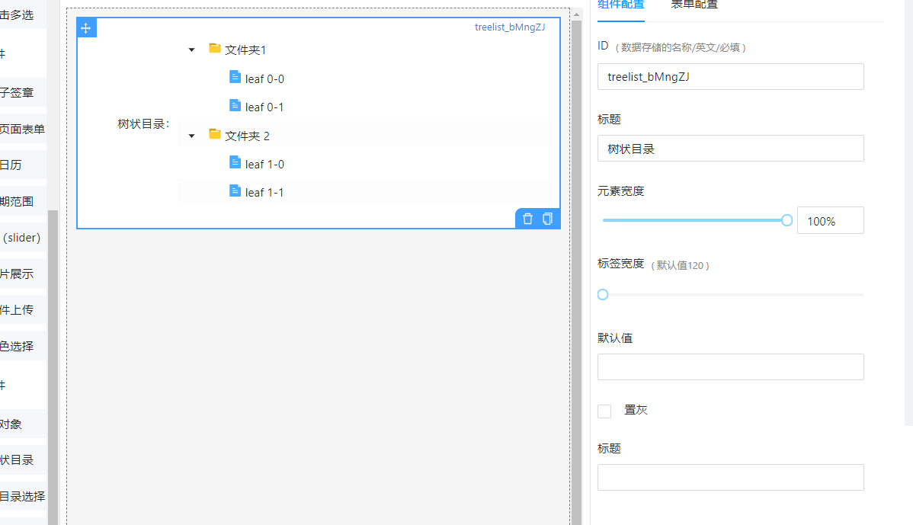
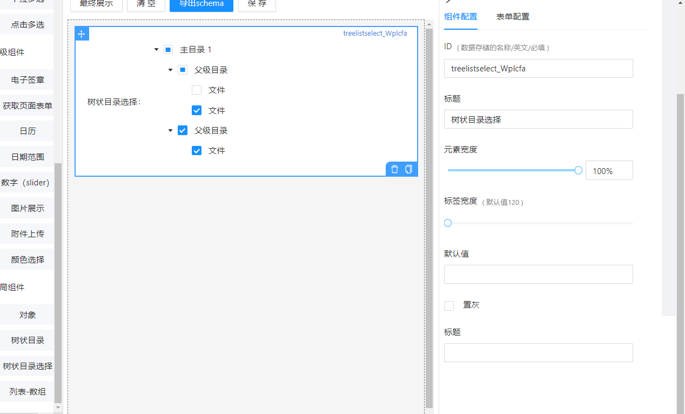
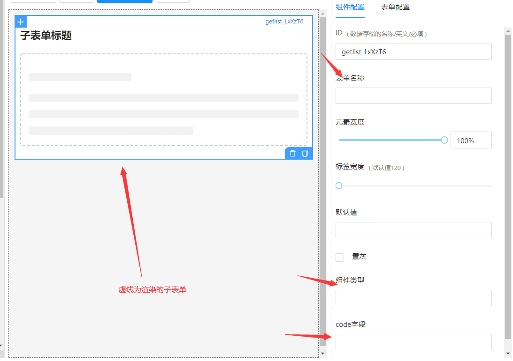
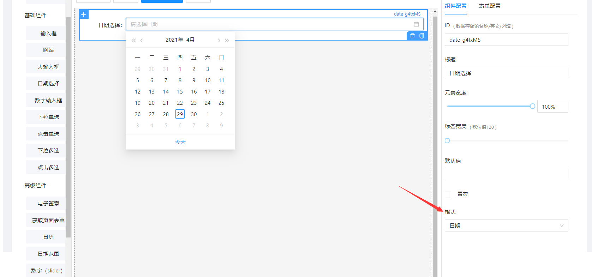
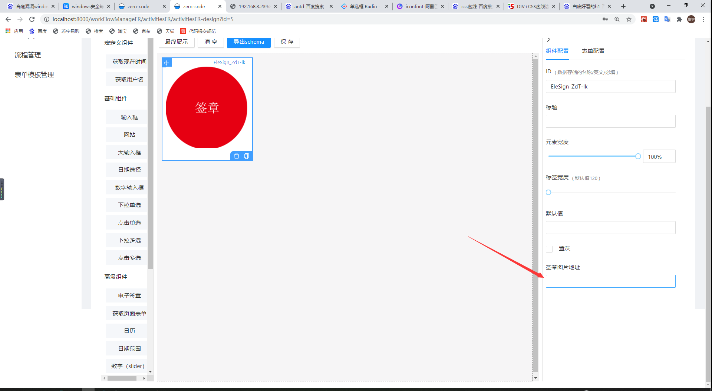

## 关于 form-render

### form-render 的自定义组件

#### 链接跳转

[已定义自定义组件说明](#已定义自定义组件说明)

[自定义组件左右栏配置说明](#自定义组件左右栏配置说明)

#### 官方说明文档

https://x-render.gitee.io/table-render

#### 如何使用普通组件

打开项目 zero-element-admin，找到 src 目录下-components 下的 SchemaGeneratorPage 文件夹，打开 settings.js 配置。

#### 配置说明

| 配置名                | 说明             |
| --------------------- | ---------------- |
| defaultCommonSettings | 右侧菜单配件设置 |
| UserConfig            | 左侧用户组件     |
| elements              | 左侧基础组件     |
| advancedElements      | 左侧高级组件     |
| layouts               | 左侧布局         |
| saves                 | 样例（已禁用）   |
| defaultSettings       | 左侧组件的配置   |
| defaultGlobalSettings | 右侧菜单布局设置 |

#### 配置自定义组件方法

打开 zero-element-admin，前往主目录 src/components/SchemaGeneratorPage/components，新增组件 js,输入代码，例：

> 要求：输出 hello world!

新增组件 hello.js

```
export default function(){
	return <h1>Hello World!</h1>
}
```

打开同级目录下的 index.js

添加

```
import Hello from "./hello"
```

并在

```
export const widgets={
	...
}
```

中添加 Hello,即

```
export const widgets={
	...,Hello
}
```

新增组件完成，然后我们需要调用它

前往上级目录的 settings.js 中,找到

```
export const elements ={
	...
}
```

在它里面的最后添加

```
{
   text:'Hello',
   name:"hello",
   schema:{
    type:'string',
    "ui:widget":"Hello",
  },
   widget:"Hello"
},
```

完成。

### 已定义的自定义组件

> 所有组件的用法都是直接在 schema 中插入，如有更改，会在单独组件中备注。
>
> ```
> "ui:widget":"Url"
> ```
>
> 即可。

#### 自定义组件存放地址

根目录下的 src>components>SchemaGeneratorPage>components

#### CalendarCom

**说明**

这是一个自定义的日历组件

**用法**

直接在 schema 中插入

```
"ui:widget":"CalendarCom"
```

即可。

**例子**

打开文件目录[(点击查看自定义组件地址)](#自定义组件存放地址)下的 setting.js,找到配置 davancedElements 或重新[自定义组件列表](./自定义组件左右栏配置说明)。

```
{
      text: '日历',
      name: 'calendar',
      schema: {
        title: '',
        type: 'string',
        'ui:widget': 'CalendarCom',
      },
      widget: 'CalendarCom',
      // setting: {
      //   api: { title: 'api', type: 'string' },
      // },
},
```

**图示**



#### Url

**说明**

这是一个定义了网站的组件

**用法**

直接在 schema 中插入

```
"ui:widget":"Url"
```

即可。

**例子**

```
{
      text:'网站',
      name:"web",
      schema:{
        type:'string',
        "ui:widget":"Url",
        format:'url',
        componentType:"input",
      },
      widget:"Url",
},
```

**图示**



#### NowTime

**说明**

显示当前时间（宏定义组件）

**用法**

直接在 schema 中插入

```
"ui:widget":"NowTime"
```

即可。

**例子**

```
{
      text:'获取现在时间',
      name:"GetTime",
      widget:'NowTime',
      schema:{
        type:'string',
        'ui:widget':"NowTime",
      },
},
```

**图示**



#### Elesign

**说明**

签章

**用法**

直接在 schema 中插入

```
"ui:widget":"Elesign"
```

即可。

**例子**

```
{
      text:'电子签章',
      name:"EleSign",
      widget:"Elesign",
      schema:{
        type:'string',
        'ui:widget':'Elesign',
        "ui:width":"220px"
      },
      setting:{
        "src":{
          title:'签章图片地址',
          type:'string',
        }
      }
    },
```

**设置项值**

直接在右侧配置栏输入值，导出的值会由 schema 中 properties 传值。

`src`:图片地址

**图示**



#### GetUserName

**说明**

获取当前用户名(宏定义)

**用法**

直接在 schema 中插入

```
"ui:widget":"GetUserName"
```

即可。

**例子**

```
{
      text:"获取用户名",
      name:"GetUserName",
      widget:"GetUserName",
      schema:{
        type:"string",
        "ui:widget":"GetUserName",
      }
},
```

**图示**



#### TreeDir

**说明**

普通文件树

**用法**

直接在 schema 中插入

```
"ui:widget":"TreeDir"
```

即可。

**例子**

```
{
      text:"树状目录",
      name:'treelist',
      widget:'TreeDir',
      schema:{
        title:"树状目录",
        type:'string',
        'ui:widget':'TreeDir'
      },
      setting:{
        "TreeTitle":{
          title:"标题",
          type:"string"
        }
      }
    },
```

**设置项值**

直接在右侧配置栏输入值，导出的值会由 schema 中 properties 传值。

`TreeTitle`:树标题

**图示**



#### TreeSelect

**说明**

文件选择树

**用法**

直接在 schema 中插入

```
"ui:widget":"TreeSelect"
```

即可。

**例子**

```
{
      text:"树状目录选择",
      name:'treelistselect',
      widget:'TreeSelect',
      schema:{
        title:"树状目录选择",
        type:'string',
        'ui:widget':'TreeSelect'
      },
      setting:{
        "TreeTitle":{
          title:"标题",
          type:"string"
        }
      }
    },
```

**设置项值**

直接在右侧配置栏输入值，导出的值会由 schema 中 properties 传值。

`TreeTitle`:树标题

**图示**



#### GetList

**说明**

子表单

**用法**

**例子**

```
{
      text:"子表单",
      name:"getlist",
      schema:{
        type:"string",
        "ui:widget":"GetList",
      },
      widget:"GetList",
      setting:{
            "title":{
              title:"表单名称",
              type:'string',
            },
            "componentType":{
              title:'组件类型',
              type:'string',
              value:'childrenFrom',
            },
            code:{
              title:'code字段',
              type:"string",
        }
      }
    },
```

**设置项值**

直接在右侧配置栏输入值，导出的值会由 schema 中 properties 传值。

`title` api 返回的子表单名字
`componentType` : 组件类型，默认为`childrenForm`
`code` : api 返回的 code 字段

**图示**



### form-render 的左右栏配置

#### 已有左右栏配置说明

|        配置名         |       说明       |
| :-------------------: | :--------------: |
| defaultCommonSettings | 右侧菜单配件设置 |
|      HongConfig       |  左侧宏定义组件  |
|       elements        |   左侧基础组件   |
|   advancedElements    |   左侧高级组件   |
|        layouts        |     左侧布局     |
|         saves         |  样例（已禁用）  |
|    defaultSettings    |  左侧组件的配置  |
| defaultGlobalSettings | 右侧菜单公共设置 |

#### 如何配置左侧栏新配置说明

##### 例子

使用

```
export const 自定义名= [
	...内容
]
```

然后找到

```
export const defaultSettings = [
	...内容
]
```

在已有内容后面添加

```
{
	title:"名称",
	widgets:"你刚刚所定义的自定义名"
}
```

增加左侧栏配置完成

#### 如何单独配置各个属性的右侧栏新配置说明

##### 官方定义的配置

更多前往[官网旧文档](http://x-components.gitee.io/form-render/config/ui-schema#%E5%85%B1%E9%80%9A%E7%9A%84%E8%A1%A8%E5%8D%95-ui-%E9%85%8D%E7%BD%AE)

使用 setting()来配置，例：

```
{
text: '日期选择',
name: 'date',
widget: 'date',
schema: {
    title: '日期选择',
    type: 'string',
    format: 'date',
    componentType: 'date'
    },
setting: {
    format: {
        title: '格式',
        type: 'string',
        enum: ['dateTime', 'date', 'time'],
        enumNames: ['日期时间', '日期', '时间'],
        },
    },
},
```

以上是官方的例子做的设置说明，显示如下



##### 如何自定义新配置

同理，直接配置 setting 即可，例：

```
{
      text:'电子签章',
      name:"EleSign",
      widget:"Elesign",
      schema:{
        type:'string',
        'ui:widget':'Elesign',
        "ui:width":"220px"
      },
      setting:{
        "src":{
          title:'签章图片地址',
          type:'string',
        }
    }
},
```

如图



完成。
