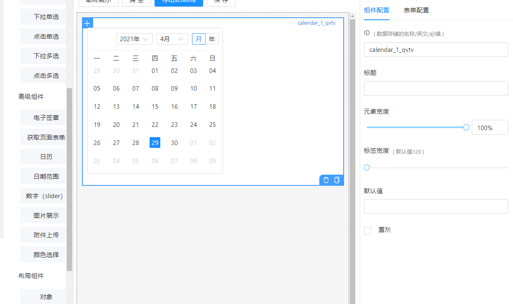
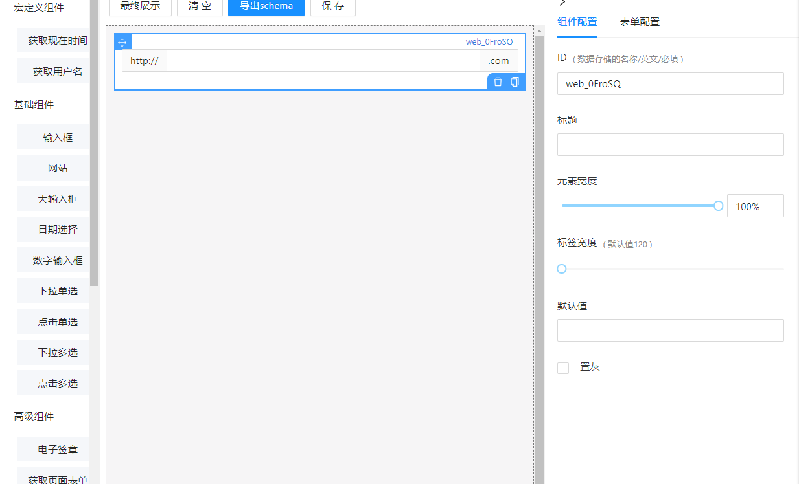
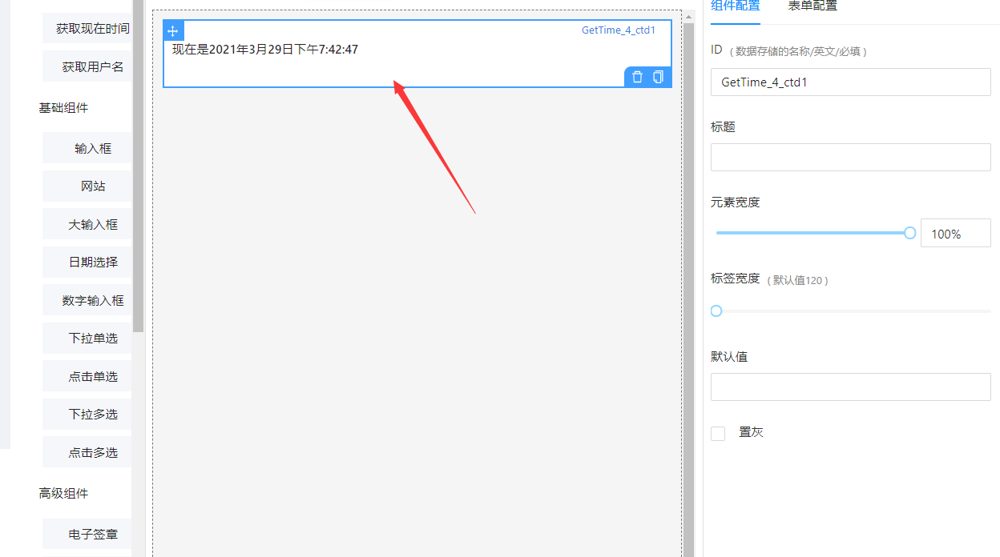
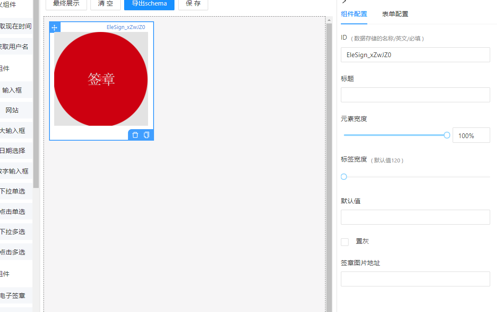
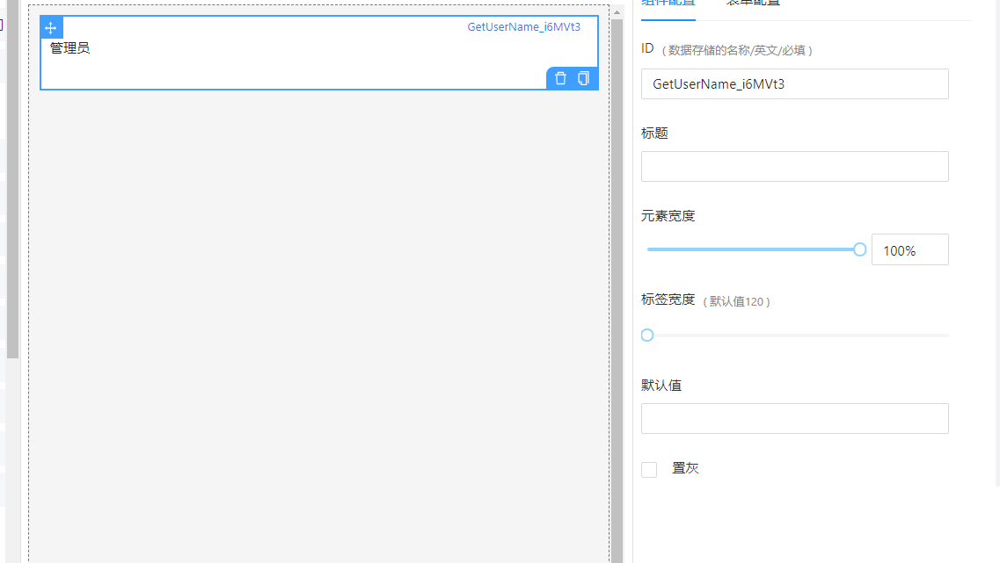
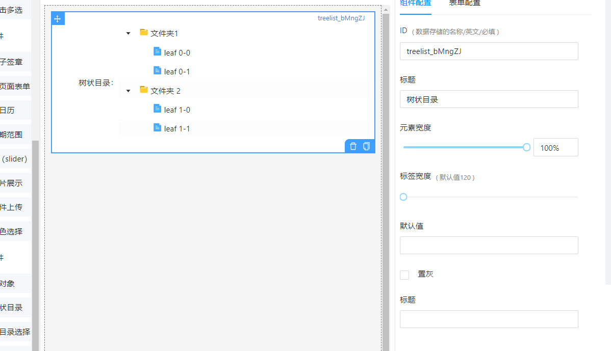
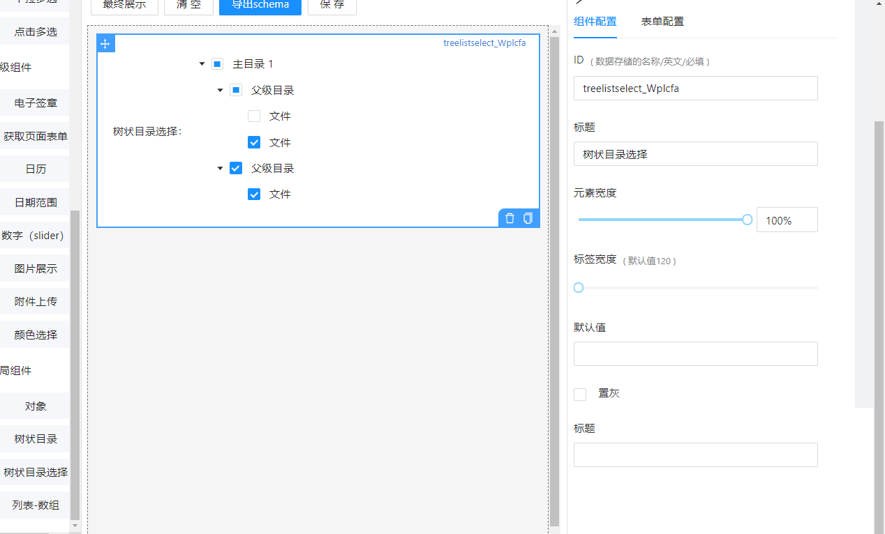
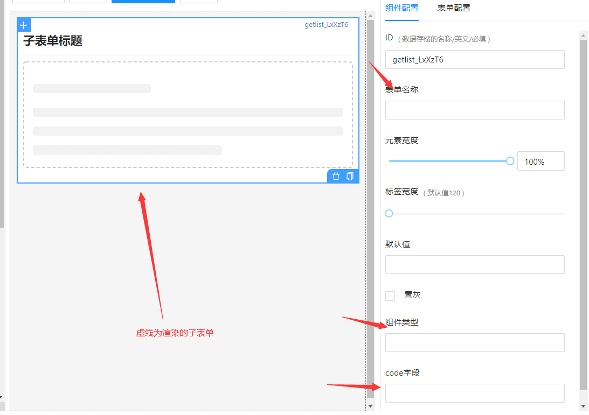

# 已定义的自定义组件说明

> 所有组件的用法都是直接在 schema 中插入，如有更改，会在单独组件中备注。
>
> ```
> "ui:widget":"Url"
> ```
>
> 即可。

## 自定义组件存放地址

根目录下的 src>components>SchemaGeneratorPage>components

## CalendarCom

**说明**

这是一个自定义的日历组件

**用法**

直接在 schema 中插入

```
"ui:widget":"CalendarCom"
```

即可。

**例子**

打开文件目录[(点击查看自定义组件地址)](#自定义组件存放地址)下的 setting.js,找到配置 davancedElements 或重新[自定义组件列表](./自定义组件左右栏配置说明)。

```
{
      text: '日历',
      name: 'calendar',
      schema: {
        title: '',
        type: 'string',
        'ui:widget': 'CalendarCom',
      },
      widget: 'CalendarCom',
      // setting: {
      //   api: { title: 'api', type: 'string' },
      // },
},
```

**图示**



## Url

**说明**

这是一个定义了网站的组件

**用法**

直接在 schema 中插入

```
"ui:widget":"Url"
```

即可。

**例子**

```
{
      text:'网站',
      name:"web",
      schema:{
        type:'string',
        "ui:widget":"Url",
        format:'url',
        componentType:"input",
      },
      widget:"Url",
},
```

**图示**



## NowTime

**说明**

显示当前时间（宏定义组件）

**用法**

直接在 schema 中插入

```
"ui:widget":"NowTime"
```

即可。

**例子**

```
{
      text:'获取现在时间',
      name:"GetTime",
      widget:'NowTime',
      schema:{
        type:'string',
        'ui:widget':"NowTime",
      },
},
```

**图示**



## Elesign

**说明**

签章

**用法**

直接在 schema 中插入

```
"ui:widget":"Elesign"
```

即可。

**例子**

```
{
      text:'电子签章',
      name:"EleSign",
      widget:"Elesign",
      schema:{
        type:'string',
        'ui:widget':'Elesign',
        "ui:width":"220px"
      },
      setting:{
        "src":{
          title:'签章图片地址',
          type:'string',
        }
      }
    },
```

**设置项值**

直接在右侧配置栏输入值，导出的值会由 schema 中 properties 传值。

`src`:图片地址

**图示**



## GetUserName

**说明**

获取当前用户名(宏定义)

**用法**

直接在 schema 中插入

```
"ui:widget":"GetUserName"
```

即可。

**例子**

```
{
      text:"获取用户名",
      name:"GetUserName",
      widget:"GetUserName",
      schema:{
        type:"string",
        "ui:widget":"GetUserName",
      }
},
```

**图示**



## TreeDir

**说明**

普通文件树

**用法**

直接在 schema 中插入

```
"ui:widget":"TreeDir"
```

即可。

**例子**

```
{
      text:"树状目录",
      name:'treelist',
      widget:'TreeDir',
      schema:{
        title:"树状目录",
        type:'string',
        'ui:widget':'TreeDir'
      },
      setting:{
        "TreeTitle":{
          title:"标题",
          type:"string"
        }
      }
    },
```

**设置项值**

直接在右侧配置栏输入值，导出的值会由 schema 中 properties 传值。

`TreeTitle`:树标题

**图示**



## TreeSelect

**说明**

文件选择树

**用法**

直接在 schema 中插入

```
"ui:widget":"TreeSelect"
```

即可。

**例子**

```
{
      text:"树状目录选择",
      name:'treelistselect',
      widget:'TreeSelect',
      schema:{
        title:"树状目录选择",
        type:'string',
        'ui:widget':'TreeSelect'
      },
      setting:{
        "TreeTitle":{
          title:"标题",
          type:"string"
        }
      }
    },
```

**设置项值**

直接在右侧配置栏输入值，导出的值会由 schema 中 properties 传值。

`TreeTitle`:树标题

**图示**



## GetList

**说明**

子表单

**用法**

**例子**

```
{
      text:"子表单",
      name:"getlist",
      schema:{
        type:"string",
        "ui:widget":"GetList",
      },
      widget:"GetList",
      setting:{
            "title":{
              title:"表单名称",
              type:'string',
            },
            "componentType":{
              title:'组件类型',
              type:'string',
              value:'childrenFrom',
            },
            code:{
              title:'code字段',
              type:"string",
        }
      }
    },
```

**设置项值**

直接在右侧配置栏输入值，导出的值会由 schema 中 properties 传值。

`title` api 返回的子表单名字
`componentType` : 组件类型，默认为`childrenForm`
`code` : api 返回的 code 字段

**图示**



## 链接跳转

### 自定义组件位置

[自定义组件配置说明](./关于schema自定义组件#配置说明)
