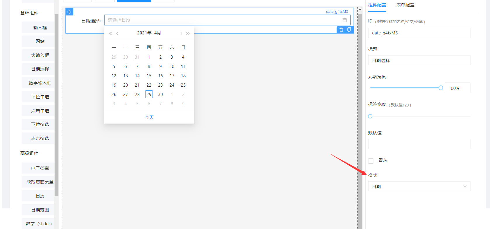
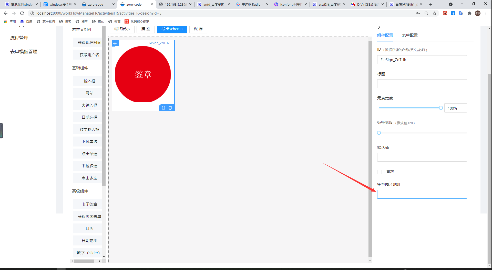

## 已有配置说明

|        配置名         |       说明       |
| :-------------------: | :--------------: |
| defaultCommonSettings | 右侧菜单配件设置 |
|      HongConfig       |  左侧宏定义组件  |
|       elements        |   左侧基础组件   |
|   advancedElements    |   左侧高级组件   |
|        layouts        |     左侧布局     |
|         saves         |  样例（已禁用）  |
|    defaultSettings    |  左侧组件的配置  |
| defaultGlobalSettings | 右侧菜单公共设置 |

## 如何配置左侧栏新配置说明

### 例子

使用

```
export const 自定义名= [
	...内容
]
```

然后找到

```
export const defaultSettings = [
	...内容
]
```

在已有内容后面添加

```
{
	title:"名称",
	widgets:"你刚刚所定义的自定义名"
}
```

增加左侧栏配置完成

## 如何单独配置各个属性的右侧栏新配置说明

### 官方定义的配置

更多前往[官网旧文档](http://x-components.gitee.io/form-render/config/ui-schema#%E5%85%B1%E9%80%9A%E7%9A%84%E8%A1%A8%E5%8D%95-ui-%E9%85%8D%E7%BD%AE)

使用 setting()来配置，例：

```
{
text: '日期选择',
name: 'date',
widget: 'date',
schema: {
    title: '日期选择',
    type: 'string',
    format: 'date',
    componentType: 'date'
    },
setting: {
    format: {
        title: '格式',
        type: 'string',
        enum: ['dateTime', 'date', 'time'],
        enumNames: ['日期时间', '日期', '时间'],
        },
    },
},
```

以上是官方的例子做的设置说明，显示如下



### 如何自定义新配置

同理，直接配置 setting 即可，例：

```
{
      text:'电子签章',
      name:"EleSign",
      widget:"Elesign",
      schema:{
        type:'string',
        'ui:widget':'Elesign',
        "ui:width":"220px"
      },
      setting:{
        "src":{
          title:'签章图片地址',
          type:'string',
        }
    }
},
```

如图



完成。
